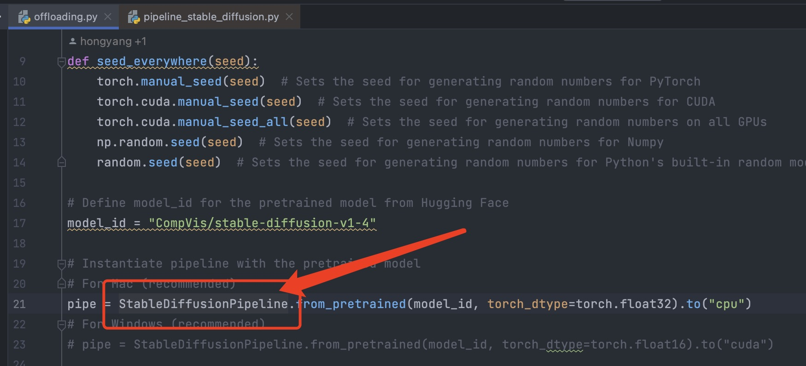

# DistributedDiffusion

This repository contains a partial implementation of the algorithm as presented in:

> **"Exploring Collaborative Distributed Diffusion-Based AI-Generated Content (AIGC) in Wireless Networks"**

---

## 📝 Table of Contents
- [Environment Setup](#-environment-setup)
- [Activate Environment](#-activate-environment)
- [Install Required Packages](#-install-required-packages)
- [Locate StableDiffusionPipeline](#-locate-stablediffusionpipeline)
- [Replace with Project File](#-replace-with-project-file)
- [Run the Program](#-run-the-program)
- [Cite Our Work](#-cite-our-work)

---

## 🔧 Environment Setup
To create a new conda environment, run the following command:

```bash
conda create --name disdiff python==3.9
```
## ⚡Activate Environment
Activate the created environment with:
```bash
conda activate disdiff
```

## 📦 Install Required Packages
You need to install the following packages using pip:
```bash
pip install diffusers==0.13.1
pip install torch
pip install transformers
pip install accelerate
```

## 🔍 Locate StableDiffusionPipeline
Open `offloading.py` in your code editor. Hold `ctrl` key if you are on Windows or `command` key if you are on Mac, and click on `StableDiffusionPipeline`



This will navigate to the file `pipeline_stable_diffusion.py`. To locate this file in your directory, right-click on the filename and choose 'open in' -> 'finder'.
</details>

## 🔄 Replace with Project File
Replace `pipeline_stable_diffusion.py` with the file of the same name from this repository.

## 🏃‍♀️ Run the Program
Finally, run `offloading.py` to start the program.

---

## 📚 Cite Our Work

If our code proves useful in your research, please consider citing our work:

```bibtex
@article{du2023exploring,
title={Exploring Collaborative Distributed Diffusion-Based AI-Generated Content (AIGC) in Wireless Networks},
author={Du, Hongyang and Zhang, Ruichen and Niyato, Dusit and Kang, Jiawen and Xiong, Zehui and Kim, Dong In and Poor, H Vincent and others},
journal={arXiv preprint arXiv:2304.03446},
year={2023}
}
```
