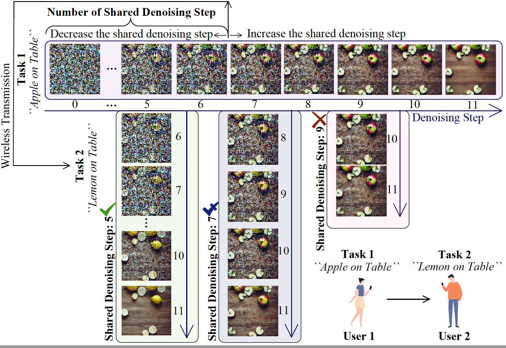
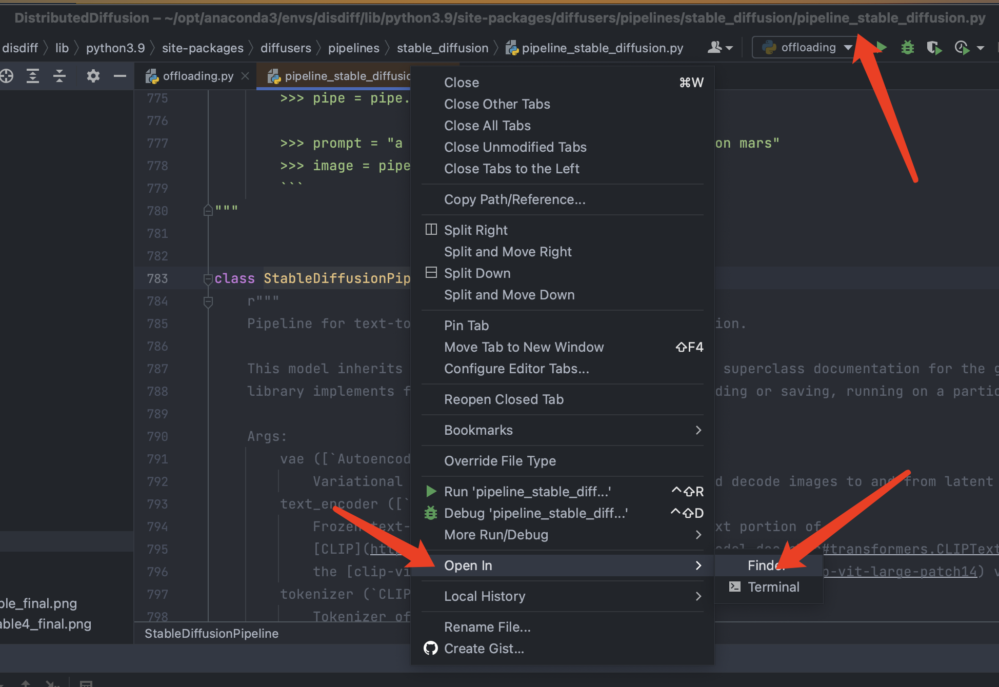
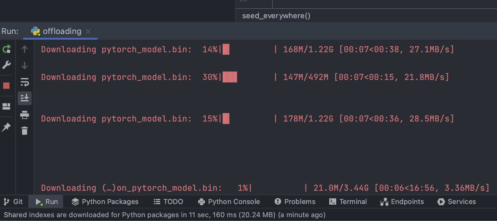
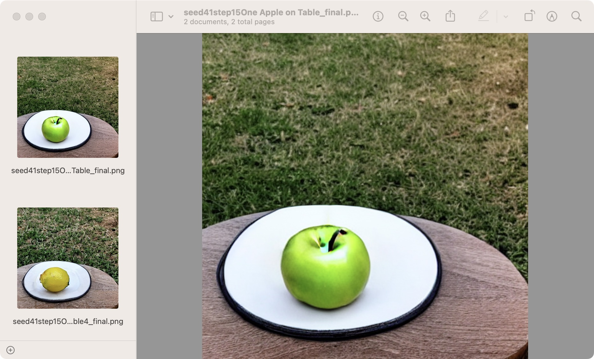

# DistributedDiffusion

This repository contains a demo implementation of the algorithm as presented in:

> **"User-Centric Interactive AI for Distributed Diffusion Model-based AI-Generated Content" [Download Paper](journal_paper.pdf)**

and

> **"Exploring Collaborative Distributed Diffusion-Based AI-Generated Content (AIGC) in Wireless Networks" [Download Paper](mag_paper.pdf)**



---

## 📝 Table of Contents
- [Environment Setup](#-environment-setup)
- [Activate Environment](#-activate-environment)
- [Install Required Packages](#-install-required-packages)
- [Locate StableDiffusionPipeline](#-locate-stablediffusionpipeline)
- [Replace with Project File](#-replace-with-project-file)
- [Run the Program](#-run-the-program)
- [Cite Our Work](#-cite-our-work)

---

## 🔧 Environment Setup
To create a new conda environment, run the following command:

```bash
conda create --name disdiff python==3.9
```
## ⚡Activate Environment
Activate the created environment with:
```bash
conda activate disdiff
```

## 📦 Install Required Packages
You need to install the following packages using pip:
```bash
pip install diffusers==0.13.1
pip install torch==2.0.1
pip install transformers==4.29.2
pip install accelerate==0.20.0
```

Then you should get an env like mine:
```
(disdiff) Hongyang_Du@MacBook-Pro-3 ~ % conda list
# packages in environment at /Users/Hongyang_Du/opt/anaconda3/envs/disdiff:
#
# Name                    Version                   Build  Channel
accelerate                0.20.0                   pypi_0    pypi
ca-certificates           2023.01.10           hecd8cb5_0  
certifi                   2023.5.7                 pypi_0    pypi
charset-normalizer        3.1.0                    pypi_0    pypi
diffusers                 0.13.1                   pypi_0    pypi
filelock                  3.12.0                   pypi_0    pypi
fsspec                    2023.5.0                 pypi_0    pypi
huggingface-hub           0.15.1                   pypi_0    pypi
idna                      3.4                      pypi_0    pypi
importlib-metadata        6.6.0                    pypi_0    pypi
jinja2                    3.1.2                    pypi_0    pypi
libcxx                    14.0.6               h9765a3e_0  
libffi                    3.3                  hb1e8313_2  
markupsafe                2.1.3                    pypi_0    pypi
mpmath                    1.3.0                    pypi_0    pypi
ncurses                   6.4                  hcec6c5f_0  
networkx                  3.1                      pypi_0    pypi
numpy                     1.24.3                   pypi_0    pypi
openssl                   1.1.1t               hca72f7f_0  
packaging                 23.1                     pypi_0    pypi
pillow                    9.5.0                    pypi_0    pypi
pip                       23.0.1           py39hecd8cb5_0  
psutil                    5.9.5                    pypi_0    pypi
python                    3.9.0                h88f2d9e_2  
pyyaml                    6.0                      pypi_0    pypi
readline                  8.2                  hca72f7f_0  
regex                     2023.6.3                 pypi_0    pypi
requests                  2.31.0                   pypi_0    pypi
setuptools                67.8.0           py39hecd8cb5_0  
sqlite                    3.41.2               h6c40b1e_0  
sympy                     1.12                     pypi_0    pypi
tk                        8.6.12               h5d9f67b_0  
tokenizers                0.13.3                   pypi_0    pypi
torch                     2.0.1                    pypi_0    pypi
tqdm                      4.65.0                   pypi_0    pypi
transformers              4.29.2                   pypi_0    pypi
typing-extensions         4.6.3                    pypi_0    pypi
tzdata                    2023c                h04d1e81_0  
urllib3                   2.0.3                    pypi_0    pypi
wheel                     0.38.4           py39hecd8cb5_0  
xz                        5.4.2                h6c40b1e_0  
zipp                      3.15.0                   pypi_0    pypi
zlib                      1.2.13               h4dc903c_0
```

## 🔍 Locate StableDiffusionPipeline
Open `offloading.py` in your code editor. Hold `ctrl` key if you are on Windows or `command` key if you are on Mac, and click on `StableDiffusionPipeline`


This will navigate to the file `pipeline_stable_diffusion.py`. To locate this file in your directory, right-click on the filename and choose 'open in' -> 'finder'.



## 🔄 Replace with Project File
Replace `pipeline_stable_diffusion.py` with the file of the same name from this repository.


## 🏃‍♀️ Run the Program
Finally, run `offloading.py` to start the program.

Please note that the model will be downloaded automatically if you are running this code for the first time.
 


## 🔍 Check the results

The parameter "tt" is the offloading processing point

The parameter "ss" is the total denosing steps

For more details, please check the `offloading.py`


 
---

## 📚 Cite Our Work

If our code proves useful in your research, please consider citing our work:

```bibtex
@article{du2023user,
  title={User-Centric Interactive AI for Distributed Diffusion Model-based AI-Generated Content},
  author={Du, Hongyang and Zhang, Ruichen and Niyato, Dusit and Kang, Jiawen and Xiong, Zehui and Cui, Shuguang and Shen, Xuemin and Kim, Dong In},
  journal={arXiv preprint arXiv:2311.11094},
  year={2023}
}
```


```bibtex
@article{du2023exploring,
  title={Exploring Collaborative Distributed Diffusion-Based AI-Generated Content (AIGC) in Wireless Networks},
  author={Du, Hongyang and Zhang, Ruichen and Niyato, Dusit and Kang, Jiawen and Xiong, Zehui and Kim, Dong In and Poor, H Vincent},
  journal={arXiv preprint arXiv:2304.03446},
  year={2023}
}
```
